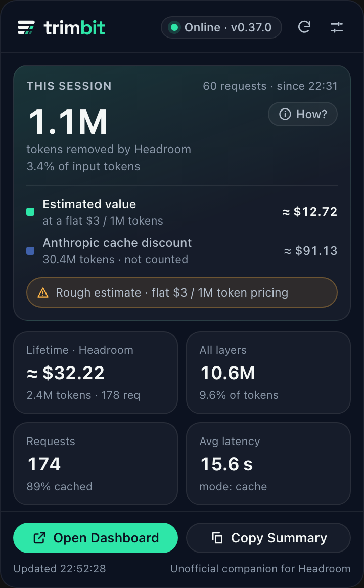
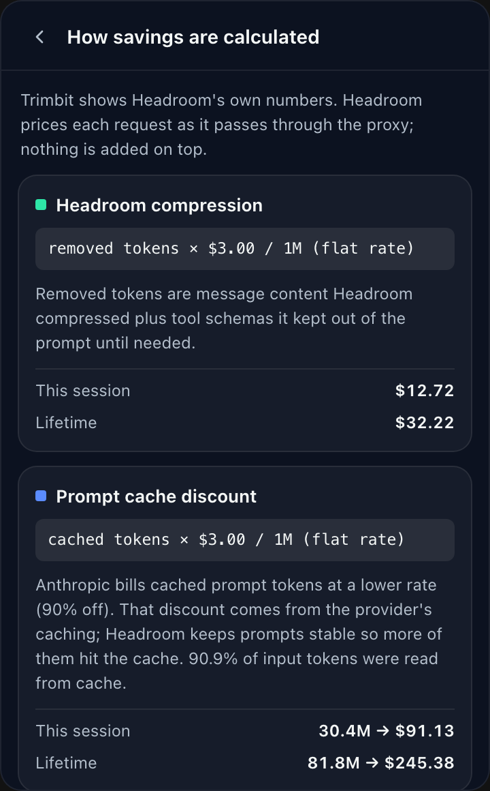
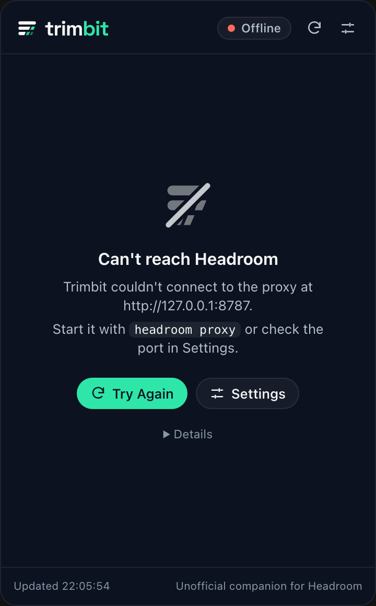

<p align="center">
  
  
</p>

<p align="center"><b>An unofficial menu bar companion for <a href="https://github.com/chopratejas/headroom">Headroom</a>.</b><br>
See what your local Headroom proxy saves you, live, on macOS, Windows and Linux.</p>

> Trimbit is an independent project. It is not affiliated with or endorsed by the Headroom project.

<p align="center">
  
  
  
</p>

## Features

**In the tray**

- Session or lifetime tokens removed, their estimated value, or just the icon. You choose in Settings.
- The icon changes when the proxy is unreachable. The tooltip and menu carry a one-line summary.
- Right-click menu: Open Trimbit, Refresh Now, Open Headroom Dashboard, Copy Summary, Settings, Quit.

**In the panel** (left-click the tray icon; right-click opens the menu)

- **This session**: tokens Headroom removed (measured) as the headline, with their estimated dollar value. The
  provider's prompt-cache discount is shown separately for context and is not counted as Headroom's saving.
- **How savings are calculated**: the formula behind every dollar figure, where prices come from, and a clear
  warning when Headroom is using a flat fallback rate (see [below](#how-savings-are-calculated)).
- **Lifetime and proxy totals**: lifetime value, all-layer token savings, requests and cache hit rate,
  average latency, tool-schema vs. compression split, top models, and Headroom's own optimization tips.
- **Honest status**: online, degraded or offline, with proxy version and uptime. When the proxy goes away, the
  last known data stays on screen and is marked as stale.

**Everywhere**

- **Exact or short numbers**: `1.1M` or `1,054,759`. In short mode, hover any count to see the exact value.
- **Native look**: Liquid Glass on macOS 26+ (vibrancy on older macOS), Fluent Acrylic on Windows, and an opaque
  panel on Linux. Corner radii and control shapes follow each platform.
- Notifications when the proxy goes down or comes back.
- Light and dark themes, keyboard navigation and reduced-motion support.

## How savings are calculated

Trimbit doesn't price anything itself. It shows the figures Headroom reports on its local `/stats` endpoint,
which Headroom computes per request as traffic passes through the proxy.

| Figure | Formula | Counted as Headroom's saving? |
|---|---|---|
| Tokens removed (headline) | measured by Headroom per request | Yes. This is the one number Headroom measures directly. |
| Estimated value | removed tokens × model input price | Yes. *Removed tokens* are compressed message content plus tool schemas Headroom kept out of the prompt. |
| Provider cache discount | cached tokens × (input price − cache-read price) | **No.** Clients like Claude Code cache prompts on their own, so this discount mostly happens with or without Headroom. Trimbit shows it for context only. |

All dollar amounts are marked **≈**. They estimate input cost avoided; they aren't your invoice, and on a
flat-rate subscription they're an equivalent value, not money back. Output tokens are not included.

> [!IMPORTANT]
> Headroom takes per-model prices from LiteLLM's pricing table. When LiteLLM isn't available (for example on
> Python 3.14, which Headroom's dependency spec excludes), Headroom prices **every model at a flat $3.00 per 1M
> input tokens**, and values cached tokens at that full rate instead of only the discount. The cache figure is
> then likely overstated. Trimbit detects this and labels the numbers **Rough estimate**, and the panel's
> **How?** view shows the exact arithmetic.

## Install

Prebuilt installers will be attached to [Releases](../../releases) when a version is published:

| Platform | File |
|---|---|
| macOS (Apple silicon / Intel) | `Trimbit_<version>_aarch64.dmg` / `Trimbit_<version>_x64.dmg` |
| Windows 10 (1809+) / 11 | `Trimbit_<version>_x64-setup.exe` |
| Linux | `.AppImage`, `.deb` or `.rpm` |

Until then, [build from source](#development). `npm run app:build` produces the installer for your OS in
`src-tauri/target/release/bundle/`.

Then start Headroom (`headroom proxy`, default `127.0.0.1:8787`) and launch Trimbit.

<details>
<summary>Platform notes</summary>

- **macOS**: builds are not yet signed or notarized, so Gatekeeper warns on first launch. Right-click the app,
  choose **Open**, and confirm.
- **Windows**: tray icons can't show text, so hover the icon for a summary. SmartScreen may warn because the
  installer is not code-signed.
- **Linux**: needs an AppIndicator-capable panel. On GNOME, install the *AppIndicator and KStatusNotifierItem
  Support* extension. The tray icon doesn't receive clicks there, so open the panel from the tray menu
  (**Open Trimbit**).

</details>

## Using Trimbit

### Settings

| Setting | Options | Default |
|---|---|---|
| Menu bar / tray shows | Session tokens removed, session value (est.), lifetime tokens removed, lifetime value (est.), icon only | Session tokens removed |
| Numbers | Short (`1.2M`) or exact (`1,234,567`) | Short |
| Refresh every | 5, 10, 30 or 60 seconds | 10 s |
| Proxy port | 1–65535 | `8787`, or `HEADROOM_PORT` if set |
| Notify when proxy goes down or up | On / off | On |
| Launch at login | On / off | Off |

### Keyboard shortcuts (panel)

| Keys | Action |
|---|---|
| ⌘R / Ctrl+R | Refresh now |
| ⌘, / Ctrl+, | Settings |
| Esc | Back, or close the panel |
| ⌘Q / Ctrl+Q | Quit Trimbit |

### Where Trimbit keeps its files

The app identifier is `io.github.oguztozkoparan.trimbit`.

| | macOS | Windows | Linux |
|---|---|---|---|
| Settings (`settings.json`) | `~/Library/Application Support/<id>/` | `%APPDATA%\<id>\` | `~/.config/<id>/` |
| Logs (capped at about 2 MB) | `~/Library/Logs/<id>/` | `%LOCALAPPDATA%\<id>\logs\` | `~/.local/share/<id>/logs/` |

Settings → **Logs → Open Folder** jumps straight to the log directory. A corrupt settings file is renamed to
`settings.corrupt-<timestamp>.json` and Trimbit starts with defaults. Nothing is ever deleted.

### Troubleshooting

| Symptom | What to check |
|---|---|
| "Can't reach Headroom" | Is `headroom proxy` running? Does the port in Settings match the proxy's (`headroom proxy --port …`)? |
| Dollar figures look off | Open **How?** in the panel. If it says *Rough estimate*, Headroom is using the flat fallback rate. |
| No tray icon on Linux | Install an AppIndicator extension (GNOME) or enable the system tray in your panel. |
| Panel doesn't open on Linux | Use **Open Trimbit** from the tray menu. |

## Privacy and security

Trimbit only ever talks to a Headroom proxy on your own machine.

- **Network**: requests go only to loopback addresses (`127.0.0.1`, `localhost`, `::1`), and this is enforced in
  code. Redirects, system proxies and responses over 2 MB are refused.
- **No telemetry, no accounts, no secrets.** Trimbit never reads the credential fields in Headroom's stats, so
  it never displays, logs or copies them.
- **Least privilege**: the UI can call only the eight commands Trimbit defines. It has no filesystem, shell or
  network access, and runs under a strict Content Security Policy.

See [SECURITY.md](SECURITY.md) for the full threat model and how to report a vulnerability.

## Development

Requirements: [Rust](https://rustup.rs) (the toolchain is pinned in `rust-toolchain.toml` and installed
automatically by rustup), Node.js 20.19 or later, and the
[Tauri prerequisites](https://v2.tauri.app/start/prerequisites/) for your OS.

```sh
npm install
npm run app:dev        # run the app with hot reload
npm run app:build      # production build and installers in src-tauri/target/release/bundle/
```

Checks (all of these run in CI on macOS, Windows and Linux):

```sh
npm run typecheck && npm test                                   # frontend
cd src-tauri && cargo fmt --check && cargo clippy --all-targets -- -D warnings && cargo test
```

### UI preview without the backend

Run `npm run dev` and open `http://127.0.0.1:1420/preview/`. The preview mocks the IPC layer with sample data.
Combine these query parameters:

| Parameter | Values |
|---|---|
| `state` | `online` (default), `offline`, `stale`, `connecting` |
| `view` | `settings`, `method` |
| `theme` | `light`, `dark` |
| `platform` | `macos` (default), `windows`, `linux` |
| `material` | `solid` (default), `glass`, `vibrancy`, `acrylic` (approximated with CSS blur) |
| `numbers` | `compact` (default), `exact` |
| `pricing` | `fallback` (default), `litellm` |

### Layout

```
src/                 panel UI (TypeScript, no framework)
src-tauri/src/
  proxy.rs           loopback-only HTTP client and tolerant /stats parser
  settings.rs        validated settings with atomic writes
  state.rs           shared state and the payload sent to the UI
  tray.rs            tray icon, menu and panel positioning
  material.rs        native panel material per OS
  actions.rs         actions shared by the tray menu and IPC commands
  lib.rs             IPC commands, polling loop, plugin setup
src-tauri/capabilities/panel.json   the UI's entire permission set
branding/            brand kit and its generator (see branding/BRAND.md)
preview/             dev-only mocked UI preview
docs/screenshots/    images used in this README
```

## Releasing

1. Bump `version` in `package.json`, `src-tauri/Cargo.toml` and `src-tauri/tauri.conf.json`.
2. Tag and push, for example `git tag v2.0.1 && git push --tags`.
3. The Release workflow builds every platform and opens a **draft** GitHub release for review.

Code signing is optional. It switches on when the `APPLE_*` repository secrets are set (see
`.github/workflows/release.yml`). Keep certificates and passwords in GitHub secrets or your keychain, never in
the repository.

## History

Trimbit 2 replaces an earlier macOS-only Python version, archived under the
[`v1.0.0-macos-legacy`](../../tree/v1.0.0-macos-legacy) tag and deprecated.

## License

[Apache-2.0](LICENSE). The Trimbit name and logo are not covered by the license (see [NOTICE](NOTICE)).
The Space Grotesk font in `branding/fonts/` is under the SIL Open Font License 1.1.
