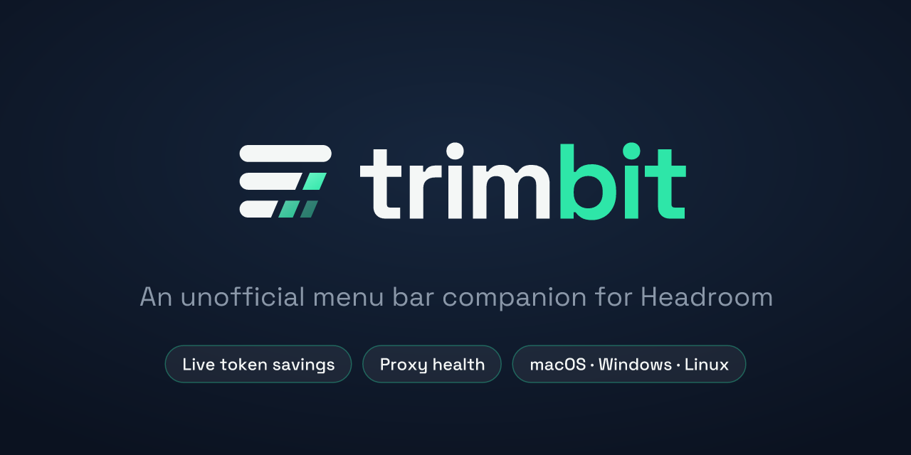
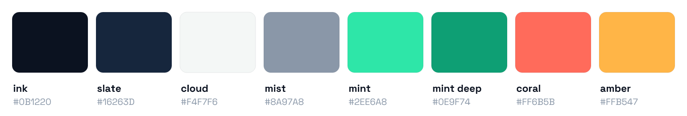

# Trimbit brand guide

**Trimbit** is an unofficial menu bar companion for the Headroom proxy.
It is not affiliated with or endorsed by the Headroom project.



## Name and voice

- Write it as **Trimbit** in prose and **trimbit** in the wordmark, identifiers, bundle names and package names.
- Tagline: *An unofficial menu bar companion for Headroom.*
- Always say "unofficial" or "for Headroom". Never "Headroom Trimbit" or "by Headroom", and never use Headroom's logo.
- Tone: short, factual and numbers-first. Show savings and don't hype them.

## The mark

Three context lines: the top one is whole, and the lower two are trimmed along a slanted cut. The trimmed
"bits" drift away, shrinking and fading. That is the product in one glyph: context in, fewer tokens out.

| Asset | Use |
|---|---|
| `svg/app-icon.svg` | App icon (macOS squircle, 1024 grid, 100 px safe margin). Feed `png/app-icon-1024.png` to `tauri icon`. |
| `svg/mark-dark-bg.svg` / `mark-light-bg.svg` | Standalone mark on dark or light surfaces |
| `svg/lockup-*.svg` | Mark and wordmark: README header, website, docs |
| `svg/wordmark-*.svg` | Wordmark alone, where the mark is already visible |
| `svg/tray-template*.svg` | macOS menu bar: black plus alpha, loaded as a template image so the OS tints it |
| `svg/tray-light*.svg` | Windows and Linux trays on **dark** panels |
| `svg/tray-dark*.svg` | Windows and Linux trays on **light** panels |
| `*-offline` variants | Proxy unreachable: dimmed glyph with a slash |
| `svg/social-card.svg` | GitHub social preview (1280×640) |

**Rules**

- Keep clear space of at least one bar height (14 % of the mark) around the mark.
- Minimum sizes: mark 16 px (use the tray variants below 32 px), wordmark 80 px wide.
- Don't recolour the bits outside the palette, rotate, outline, add shadows to or stretch the mark.
- The tray glyph snaps to a 22 px grid (4 px bars, 2 px gaps) and drops the faintest bit. Don't use the full
  mark in the menu bar.

## Colour



| Token | Hex | Role |
|---|---|---|
| `ink` | `#0B1220` | Primary dark surface and text on light |
| `slate` | `#16263D` | Raised dark surface, top of gradients |
| `cloud` | `#F4F7F6` | Primary light surface and text on dark |
| `mist` | `#8A97A8` | Secondary text on dark surfaces |
| `mint` | `#2EE6A8` | Accent on dark surfaces: savings, "bit", positive state |
| `mint_deep` | `#0E9F74` | Accent on light surfaces |
| `coral` | `#FF6B5B` | Proxy offline, errors |
| `amber` | `#FFB547` | Degraded, warnings |

Contrast (WCAG), checked by `build.py`:

| Pair | Ratio | OK for |
|---|---|---|
| cloud on ink | 17.4:1 | all text |
| mint on ink | 11.6:1 | all text |
| mist on ink | 6.3:1 | all text |
| coral on ink | 6.7:1 | all text |
| amber on ink | 10.7:1 | all text |
| mint_deep on ink | 5.6:1 | all text |
| mint_deep on cloud | 3.1:1 | **large text and graphics only** (≥ 24 px, or 18.5 px bold). Use `ink` for body text on light surfaces. |

## Type

- **Space Grotesk** (SIL OFL 1.1, `fonts/`). Bold 700 with −3.5 % tracking for the wordmark, 400/500 for UI
  and marketing copy.
- Wordmark SVGs are outlined, so they render the same with or without the font installed.
- In-app UI uses the platform system font for native feel. Space Grotesk is for brand surfaces only.

## Regenerating

All assets come from one script, so geometry and colours stay in sync:

```sh
.venv/bin/pip install -r requirements-dev.txt
.venv/bin/python branding/build.py
```

Edit `PALETTE`, `mark()` or the asset functions in `build.py`. Don't hand-edit the files in `svg/` or `png/`.
